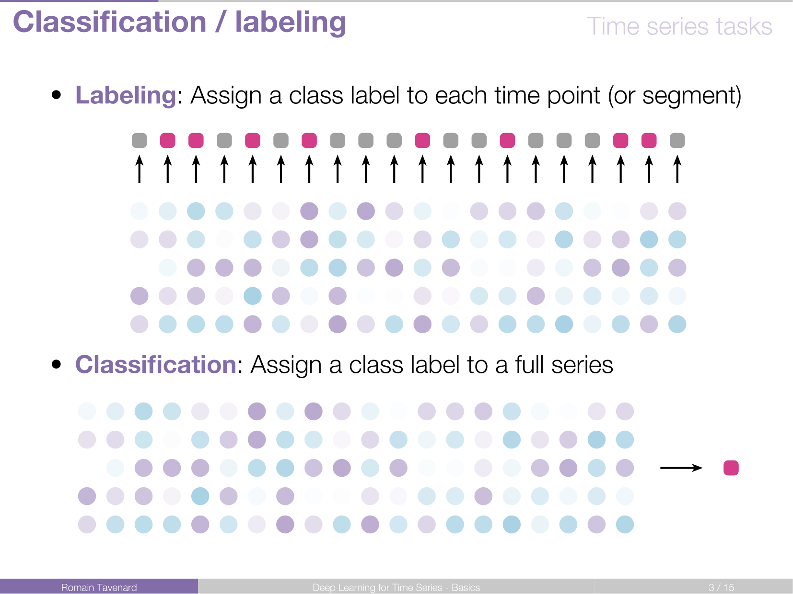
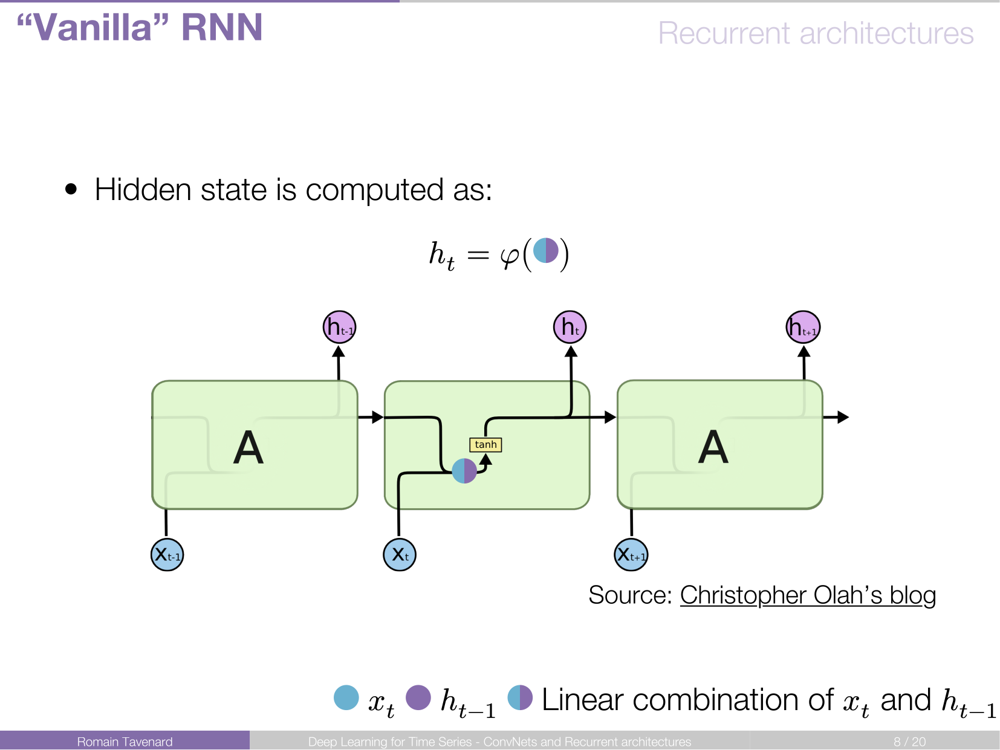
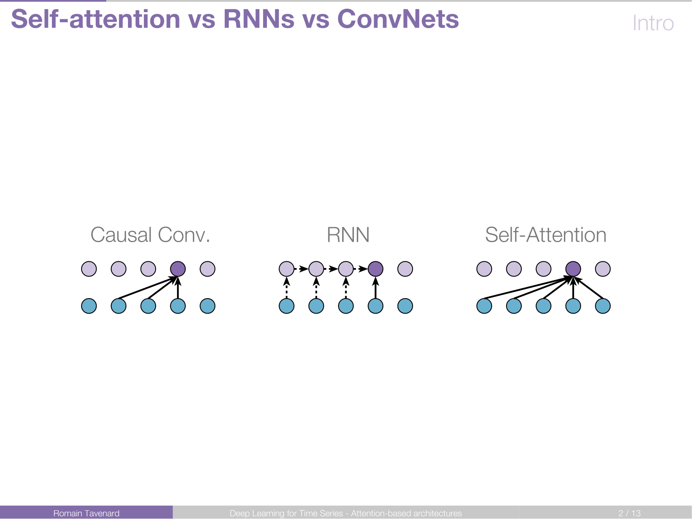
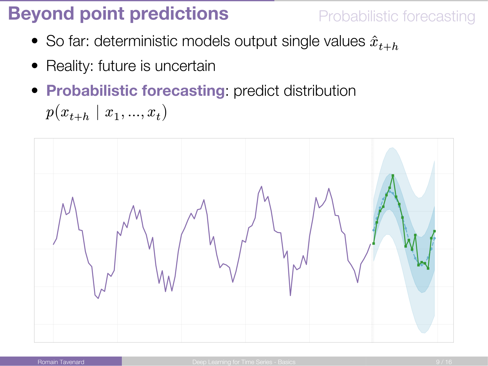
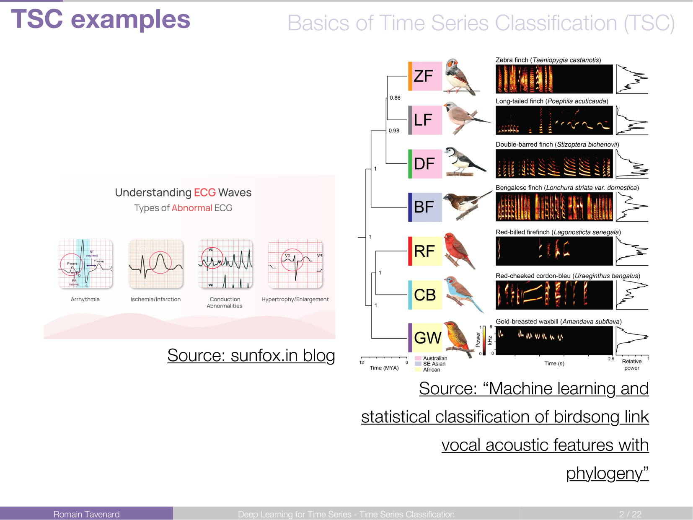
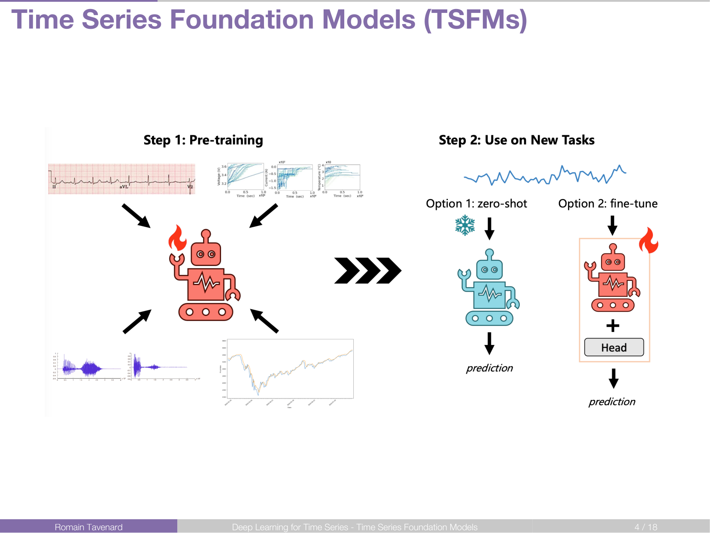
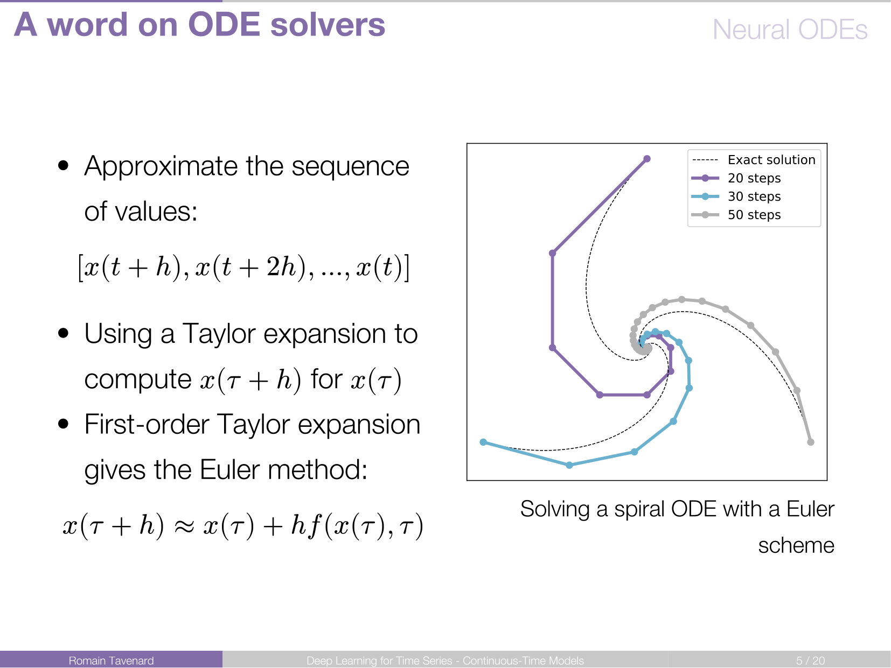
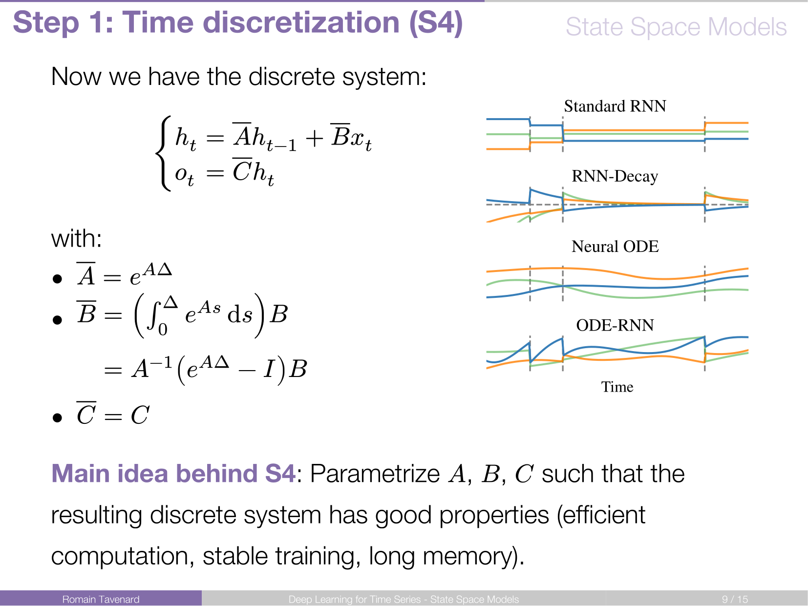

# Deep Learning for Time Series

Welcome to the course materials for **Deep Learning for Time Series**. This course is part of the data science master programme at IP Paris.
The course provides a comprehensive dive into modern neural network architectures specifically tailored for temporal data, ranging from fundamental concepts to advanced sequence modeling.

- **Target Audience:** Data scientists, researchers, and students with a basic knowledge of Machine Learning and Deep Learning.

## Course Modules

### Introduction to DL for Time Series

|  | **Overview:** An overview of why time series require specific deep learning approaches.   [Slide Deck (PDF)](./slides/01.pdf) |

---

### Convolutional Neural Networks (1D-CNNs) &  Recurrent Neural Networks (RNNs)

|  | **Overview:** Extracting local patterns vs capturing temporal dependencies.   [Slide Deck (PDF)](./slides/02.pdf)

---

### Attention Mechanisms & Transformers

|  | **Overview:** How self-attention revolutionized sequence modeling.   [Slide Deck (PDF)](./slides/03.pdf) |

---

### Practical aspects of forecasting

|  | **Overview:** From multi-step forecasting to uncertainty estimation: practical tips and tricks.   [Slide Deck (PDF)](./slides/03b.pdf)

### Time Series Classification

|  | **Overview:** How to classify sequences using deep learning architectures.   [Slide Deck (PDF)](./slides/04.pdf) |

---

### Time Series Foundation Models

|  | **Overview:** Large pre-trained models and transfer learning.   [Slide Deck (PDF)](./slides/04b.pdf) |

---

### Continuous-Time Models

|  | **Overview:** Modeling irregularly sampled data and continuous-time dynamics.   [Slide Deck (PDF)](./slides/05.pdf) |

---

### State-Space Models

|  | **Overview:** Combining deep learning with state-space modeling for time series analysis.   [Slide Deck (PDF)](./slides/06.pdf) |

## About the Instructor

**Romain Tavenard** is a Professor at _Université de Rennes 2_ and a researcher specializing in Machine Learning for Time Series. He is the creator of the [`tslearn`](https://github.com/tslearn-team/tslearn) library.

- [Personal Website](https://rtavenar.github.io)
- [Bluesky](https://bsky.app/profile/rtavenar.bsky.social)
